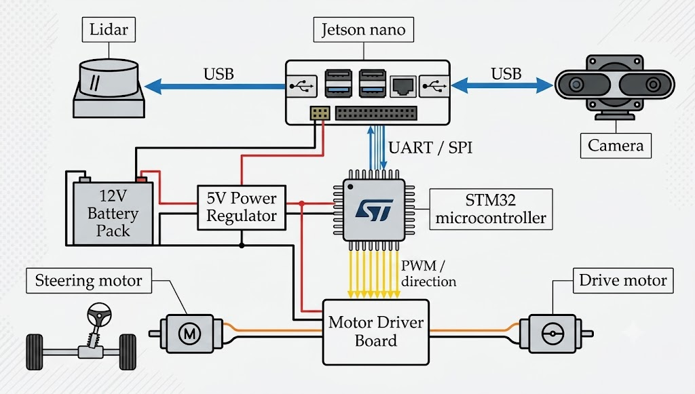
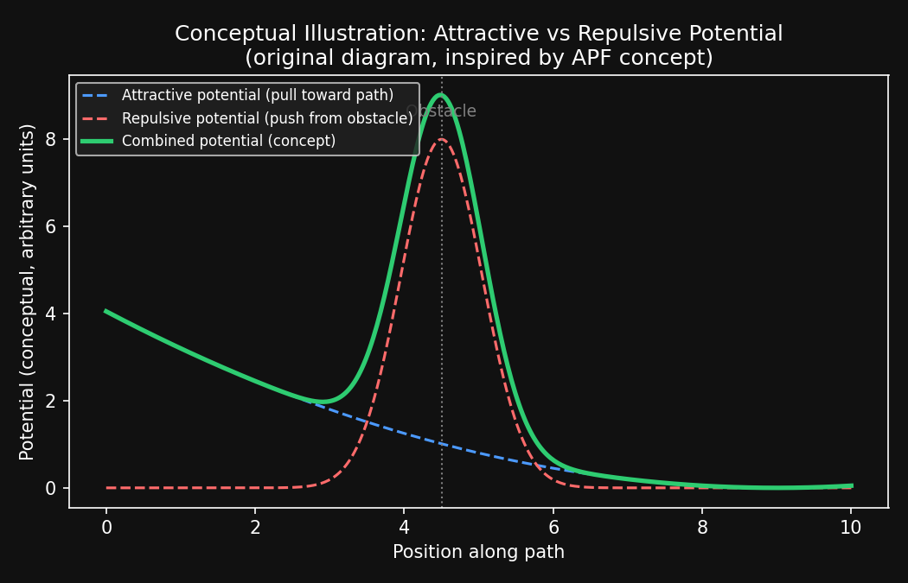
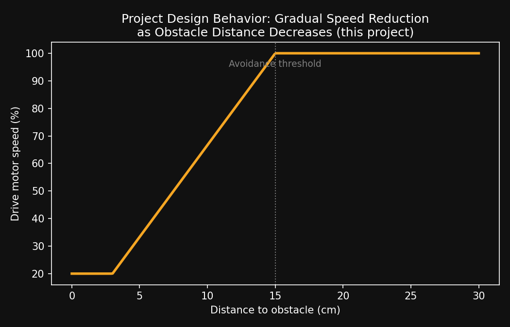
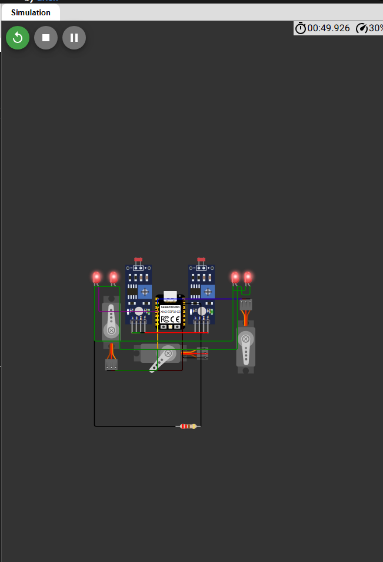

# Autonomous Obstacle-Avoidance Car

A simulation-based autonomous vehicle project that detects obstacles and dynamically adjusts its path in real time, inspired by structured-road obstacle avoidance research. Built and validated entirely in simulation (Wokwi) as part of a mechatronics engineering portfolio.


*Reference architecture showing how a full-scale autonomous vehicle sensor/compute/actuator stack (Lidar, Jetson Nano, STM32, camera) is typically organized.*

## Demo Video

Watch the full simulation running: **[https://youtu.be/RUuFZ0P9Yqw](https://youtu.be/RUuFZ0P9Yqw)**

## Table of Contents

- [Overview](#overview)
- [Motivation & Research Basis](#motivation--research-basis)
- [Concept Illustrations](#concept-illustrations)
- [Hardware / Simulation Components](#hardware--simulation-components-wokwi)
- [How It Works](#how-it-works)
- [Repository Contents](#repository-contents)
- [Limitations & Honest Scope](#limitations--honest-scope)
- [Reference](#reference)
- [Wokwi Circuit Simulation](#wokwi-circuit-simulation)

## Overview

This project implements a small-scale autonomous car that uses distance/IR sensing to detect obstacles ahead and reactively steers and adjusts motor speed to avoid collisions, before returning toward its original path. It is a simplified, hardware-in-simulation exploration of the obstacle-avoidance concepts discussed in the reference research paper below, translated into an achievable Arduino-class embedded system.

**Core capabilities:**
- Real-time obstacle detection using IR/distance sensors
- Reactive steering via servo motor
- Speed modulation as the car approaches an obstacle (slow down instead of hard stop)
- Visual status indication via onboard LEDs
- Fully simulated using Wokwi (Seeed XIAO-based circuit)

## Motivation & Research Basis

This project is inspired by the paper:

> Li, G.; Li, S.; Peng, Y. *"Obstacle Avoidance Trajectory Planning for Autonomous Vehicles on Structured Roads."* World Electric Vehicle Journal, 2024, 15(4), 168.
> Paper link: https://www.mdpi.com/2032-6653/15/4/168

The paper proposes a trajectory-planning method for autonomous vehicles that combines an improved Artificial Potential Field (APF) approach for obstacle avoidance with a speed-planning stage built on an S-T (station–time) graph, and validates the approach on a real vehicle platform in simulation.

This project does **not** implement the paper's full mathematical APF model or S-T graph planning — it is a simplified embedded-systems interpretation built for an accessible microcontroller platform (Seeed XIAO) in Wokwi. What it borrows conceptually from the paper:
- The idea that a vehicle should gradually slow as it nears an obstacle rather than react abruptly (analogous to a repulsive-force effect in APF)
- The idea that after avoiding an obstacle, the vehicle should tend back toward its original path (analogous to an attractive-force pull toward the goal trajectory)

This distinction — what was replicated conceptually versus what was simplified — is stated explicitly and intentionally, to keep the project description accurate rather than overstated.

*Note: figures and graphs from the original paper are copyrighted and are not reproduced here. You can view them directly in the paper via the link above. The diagrams below are original illustrations created for this project to explain the same underlying concepts.*

## Concept Illustrations

**Attractive vs. repulsive potential (concept)** — an original diagram illustrating the general APF-style idea this project draws on: a "pull" toward the goal path combined with a "push" away from an obstacle.



**Speed behavior implemented in this project** — how drive motor speed is reduced gradually as the measured distance to an obstacle decreases, instead of stopping abruptly:



## Hardware / Simulation Components (Wokwi)

| Component | Role |
|---|---|
| Seeed XIAO (microcontroller) | Main controller — reads sensors, runs avoidance logic, drives outputs |
| IR distance sensors (x2) | Detect obstacles ahead / to the sides |
| Servo motor | Steering actuation |
| DC motor | Drive/propulsion |
| LEDs (x4) | Status indication (turning direction / obstacle detected) |
| Resistor | Sensor/LED circuit protection |

## How It Works

1. IR sensors continuously measure distance to obstacles in front of the vehicle.
2. As the measured distance decreases, drive motor speed is reduced proportionally rather than cutting off instantly (see [speed behavior graph](#concept-illustrations) above).
3. When an obstacle is detected within the avoidance threshold, the controller commands the steering servo to turn away from the obstacle.
4. Status LEDs indicate the current maneuver (e.g., turning left/right, obstacle detected).
5. Once clear of the obstacle, the vehicle steers back toward its original heading.

## Repository Contents

```
├── README.md              # This file
├── src/                   # Arduino/Wokwi source code (.ino)
├── images/
│   ├── system_architecture.png    # Reference system architecture diagram
│   ├── apf_concept.png            # Original APF concept illustration
│   ├── speed_behavior.png         # Original speed-vs-distance behavior graph
│   └── wokwi_simulation.png       # Wokwi circuit simulation screenshot
└── docs/
    └── project_report.pdf # Short technical write-up (problem, design rationale, limitations)
```

## Limitations & Honest Scope

To keep this project academically honest:
- No formal Artificial Potential Field mathematics or S-T graph speed planning is implemented — only the conceptual behavior (gradual slowdown, return-to-path) is replicated in simplified logic.
- Testing was performed entirely in the Wokwi circuit simulator; no physical hardware was built due to budget constraints.
- Sensing is limited to short-range IR distance sensors, not Lidar or camera-based perception as in full-scale research/production systems.

## Reference

Li, G.; Li, S.; Peng, Y. Obstacle Avoidance Trajectory Planning for Autonomous Vehicles on Structured Roads. *World Electric Vehicle Journal* 2024, 15(4), 168. https://doi.org/10.3390/wevj15040168

## Wokwi Circuit Simulation


*The actual circuit used for this project: Seeed XIAO microcontroller, dual IR distance sensors, steering servo, drive motor, and status LEDs, simulated in Wokwi.*

## Author

Part of an ongoing mechatronics engineering portfolio built for undergraduate program applications, focused on simulation-based robotics and control projects (Webots, Wokwi).